---

# **QuickTask**

QuickTask is a simplified task management app designed to help users organize their tasks efficiently. Built using Flutter and Back4App, this app allows users to manage tasks with features like authentication, task creation, editing, and more. It also includes additional enhancements for an improved user experience.

---

## **Features**

### **1. User Authentication**
- Secure user sign-up and login functionality using Back4App.
- Ensures that each user's data is private and accessible only to them.

### **2. Task Management**
- Add new tasks with a title and due date.
- View a list of tasks with their details.
- Delete tasks you no longer need.

### **3. Task Status**
- Mark tasks as completed or incomplete.
- Toggle task status with ease for better organization.

---

## **Additional Features**
The following features were implemented to enhance functionality and usability:
- **Edit Task**: Users can edit the title and due date of existing tasks.
- **Search Functionality**: Added a search bar to filter tasks by their title.
- **Task Sorting**: Sort tasks by due date or status for better visibility.
- **Enhanced Error Handling**: Informative error messages for authentication and task operations.
- **Improved UI/UX**: 
  - Material Design elements for a clean and responsive interface.

---

## **Tech Stack**

### **Frontend**
- **Flutter**: For building a responsive and visually appealing user interface.

### **Backend**
- **Back4App**: Parse backend service for managing user authentication and task data.

---

## **Installation and Setup**

1. Clone the repository:
   ```bash
   git clone https://github.com/your-username/quicktask.git
   cd quicktask
   ```

2. Install dependencies:
   ```bash
   flutter pub get
   ```

3. Configure Back4App:
   - Go to [Back4App](https://www.back4app.com/) and create an account.
   - Set up a new application and obtain your **App ID**, **Client Key**, and **Server URL**.
   - Update these credentials in the `main.dart` file:
     ```dart
     const appId = 'YOUR_APP_ID';
     const clientKey = 'YOUR_CLIENT_KEY';
     const serverUrl = 'YOUR_SERVER_URL';
     ```

4. Run the app:
   ```bash
   flutter run
   ```

---

## **Usage**

1. **Sign Up / Login**:
   - Use your email and password to sign up or log in.

2. **Manage Tasks**:
   - Add tasks by providing a title and selecting a due date.
   - View all tasks in the list, edit details, or delete unwanted tasks.
   - Mark tasks as completed or incomplete.

3. **Search and Sort**:
   - Use the search bar to find tasks quickly.
   - Sort tasks by their due date or completion status.

4. **Notifications**:
   - Stay updated with timely reminders for your tasks.

---

## **Screenshots**

| **Welcome Screen**                  | **Sign Up Screen**              |
|-----------------------------------|-----------------------------------|
| 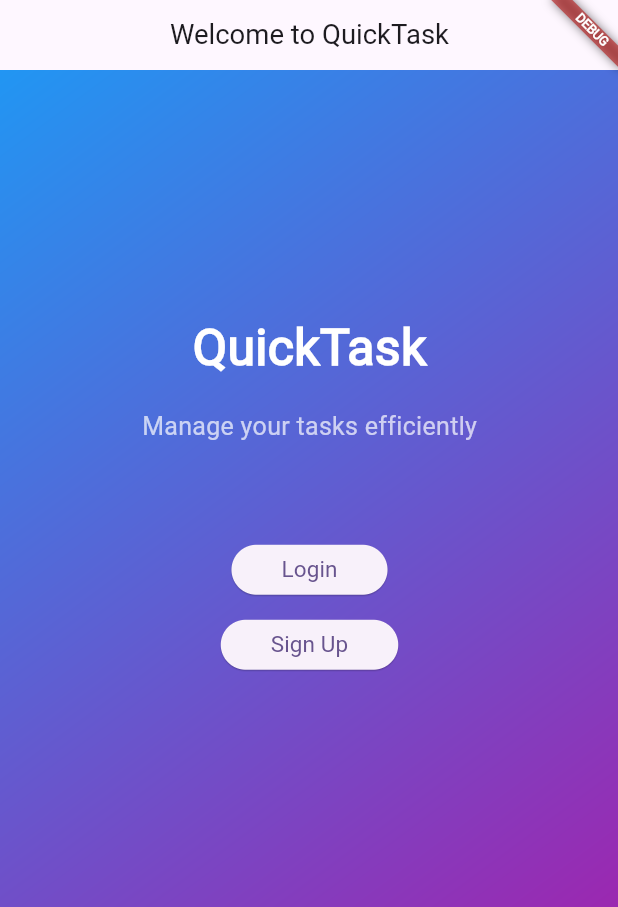 | 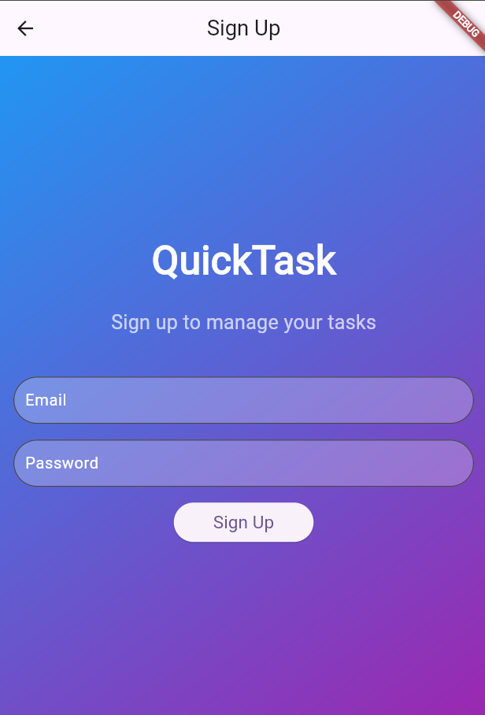 |

| **Login Screen**               | **Login Error**              |
|-----------------------------------|-----------------------------------|
| 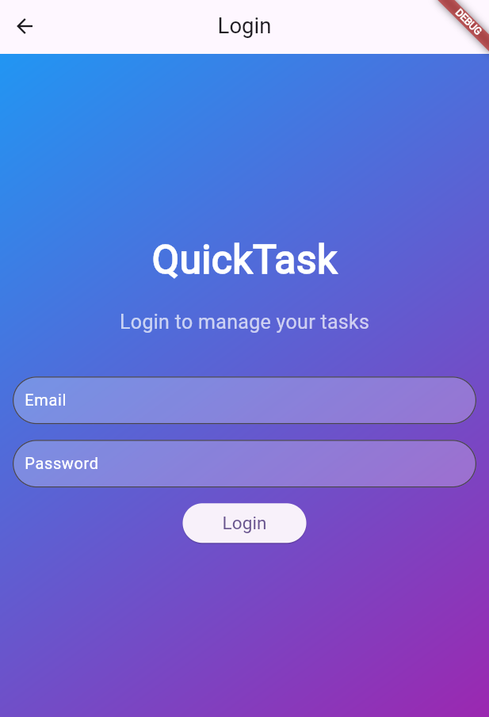 | 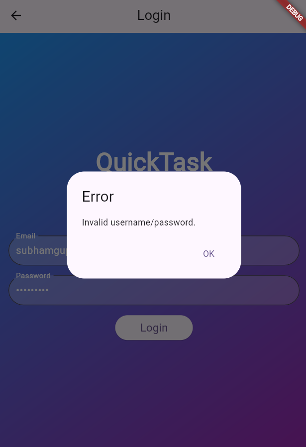 |

| **Task Lists Screen**                  | **Add Task Screen**              |
|-----------------------------------|-----------------------------------|
| 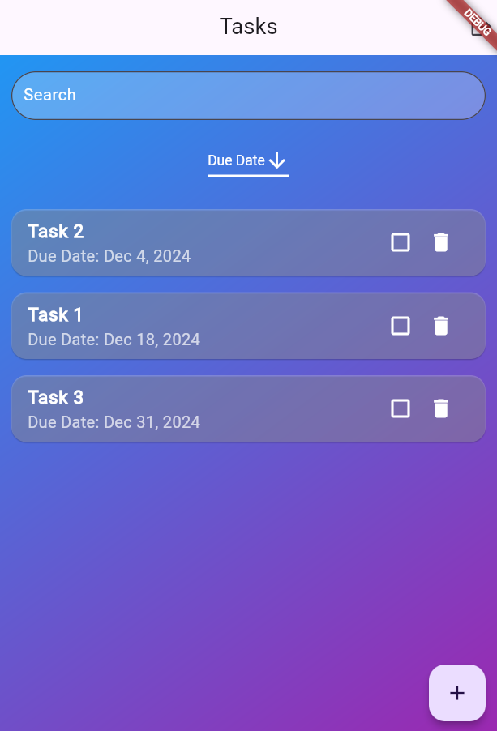 | 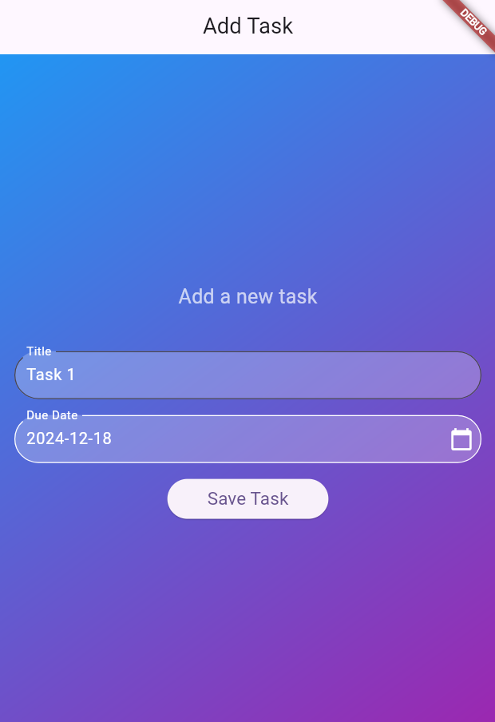 |

| **Edit Task Screen**               | **Delete Task Screen**              |
|-----------------------------------|-----------------------------------|
| 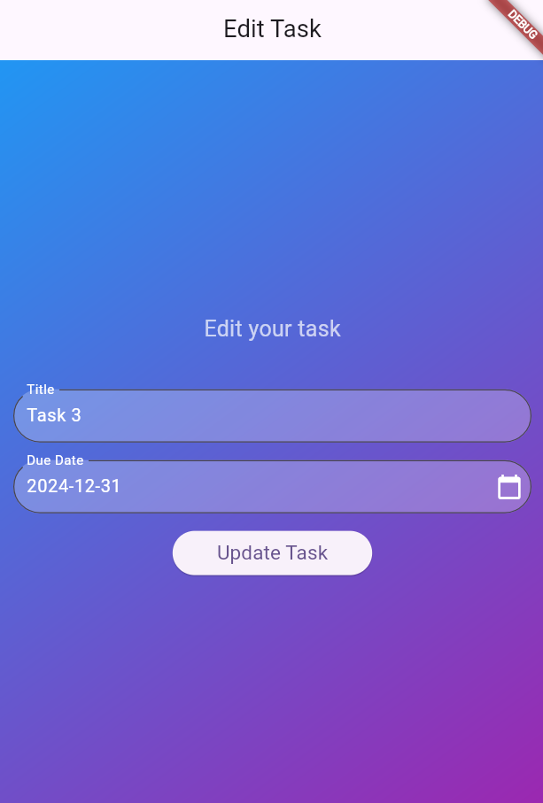 | 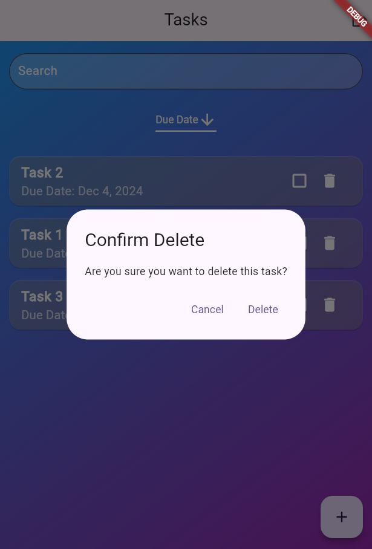 |

| **Task Search Function**                  | **Task Mark Complete**              |
|-----------------------------------|-----------------------------------|
| 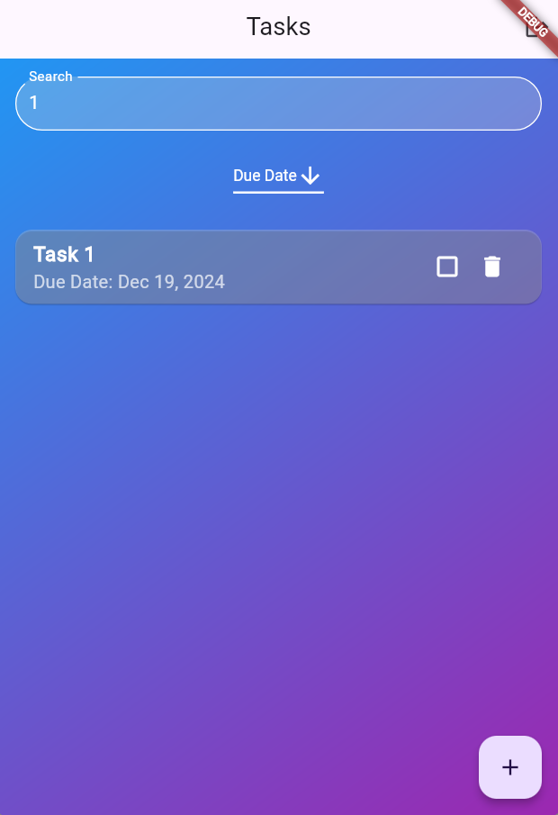 | 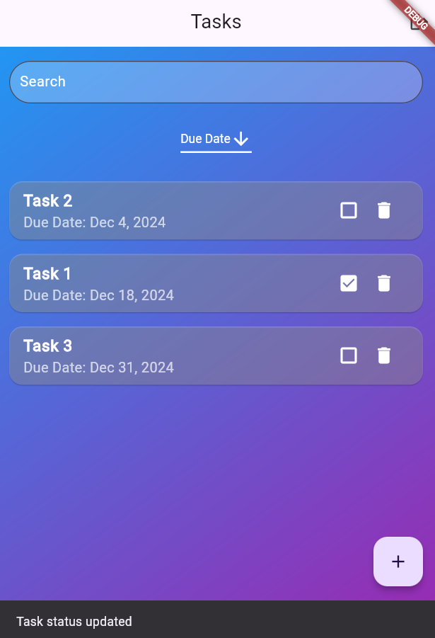 |

| **Task Sorted by Title**               | **Task Sorted by Due Date**              |
|-----------------------------------|-----------------------------------|
|  | 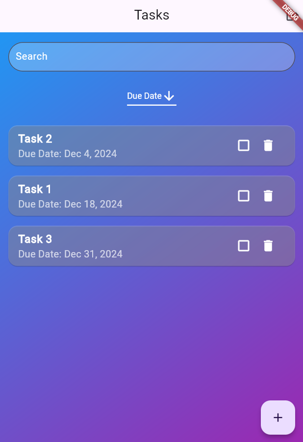 |

---

## **Contributing**

Contributions are welcome! Feel free to:
- Fork the repository.
- Create a new branch for your feature.
- Submit a pull request with detailed descriptions of the changes.

---

## **License**

This project is licensed under the MIT License. See the `LICENSE` file for details.

---

## **Contact**

For any questions or feedback, feel free to contact:

- **Your Name**: [2022mt93586@wilp.bits-pilani.ac.in](mailto:2022mt93586@wilp.bits-pilani.ac.in)
- [GitHub Profile](https://github.com/guptaSubhamKumar)

---

